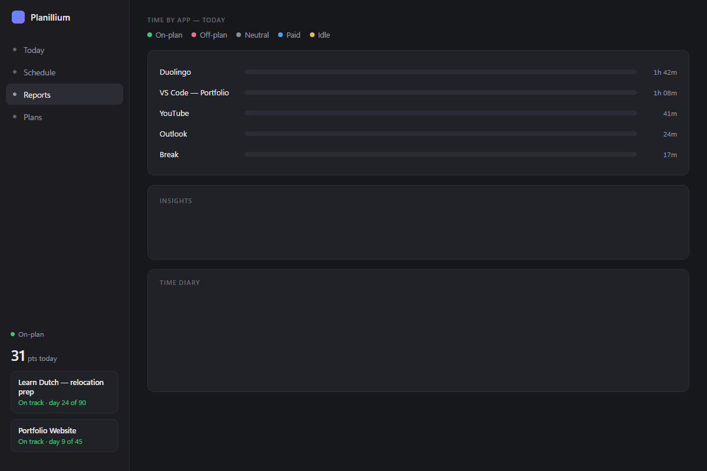

# Planillium

Planillium is a Windows desktop app built to help one person stay aligned with ambitious goals through planning, daily execution, accountability, and reflective review.

It was created for a very specific purpose: to act less like a generic task manager and more like a personal mentor and operating system for progress.



*Preview shown with sample/placeholder data, not a real user's activity history.*

## Why this app exists

In a world full of distractions, micro-tasks, everyday routine, mobile notifications, email, and everything else, it's easy to lose focus. You go through your tasks during the day, but after a month, or a year, you wake up and realize you were just running in circles — going through the motions without actually developing further, without taking that extra step forward to get better, gain some knowledge, feel more professional, understand something better.

At least that was my case. I built Planillium for myself to split the road to a goal into smaller daily steps, actually accomplish them, and move forward steadily instead of drifting. To make sure I stick to the plan, the app has a reminder function and the "authority" to punish and reward me based on how much of my day was on-plan versus off-plan — I can "buy" free time with the reward, or convert it into a small "purchase with no regrets." Childish, maybe. But gamifying it is what actually made it work for me.

The app is especially suited for people working on major life or career projects, such as career transitions, relocation plans, study programs, and long-form personal development goals.

## What it does

Planillium helps the user:

- manage up to two active plans at once,
- track daily tasks by plan day,
- reschedule or move tasks when life changes,
- record notes on tasks and progress,
- monitor on-plan vs off-plan activity,
- review weekly performance through reports,
- and stay engaged with a lightweight reward and scoring model.

## Concept

This project is built around a simple idea:

> progress improves when the system does more than collect tasks; it guides behavior, reinforces consistency, and provides feedback.

That is why the product is shaped more like a personal mentor than a traditional to-do list.

## Architecture

The current app is a WinUI 3 desktop application for Windows built with .NET 8.

### Main components

- WinUI frontend: user interface, pages, dialogs, tray experience
- Services layer: plan logic, scoring, settings, reporting, tracking
- SQLite database: progress, notes, diary, reflections, and sync state
- TickTick integration: task synchronization and project mapping
- Windows-native tracking: foreground activity and idle detection

### Key technical choices

- Windows-only desktop experience for reliability and local-first usage
- SQLite for lightweight local persistence
- Windows Credential Manager for secure credentials
- Tray-based interaction for low-friction daily use
- A modular service architecture to keep behavior understandable and extendable

## Project structure

- [winui/MentorOverseer.App](winui/MentorOverseer.App) — main application source code
- [plans](plans) — active and archived plan definitions
- [data](data) — local state and database files
- [release](release) — packaging and installer workflow
- [CONTEXT.md](CONTEXT.md) — detailed development context and project history

## Getting started

### Build

From the project root:

```powershell
dotnet build -p:Platform=x64 -c Release
```

Run from the WinUI project directory:

```powershell
cd winui/MentorOverseer.App
dotnet build -p:Platform=x64 -c Release
```

### Notes

- This app is currently designed for Windows.
- It is intended as a personal productivity and accountability tool, not a general-purpose team collaboration platform.
- The project is open-source and meant to be explored, adapted, and improved.

## Why open source

Building an app was a completely new experience for me — outside some automation flows and Microsoft Power Platform work, I have no prior coding background. I don't write or review code myself: I directed the whole build with Claude Code, describing what I needed and letting it handle the implementation, through several rounds of AI-driven build-and-test cycles, including dedicated security review passes.

I'm sharing this publicly because I think the underlying idea might help someone else stuck in the same loop, and because I'd genuinely value feedback from people with real development experience — on the UX/UI, and especially on the backend, since this whole project is a live example of what's possible when you direct rather than write the code yourself.

## License

This repository is provided as an open-source portfolio and learning project. Please review the repository license terms before reuse or redistribution.
